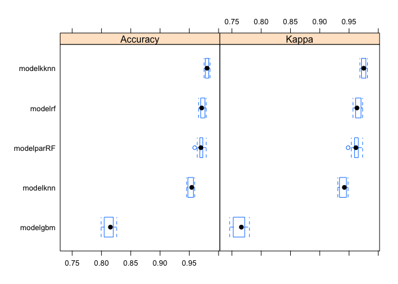
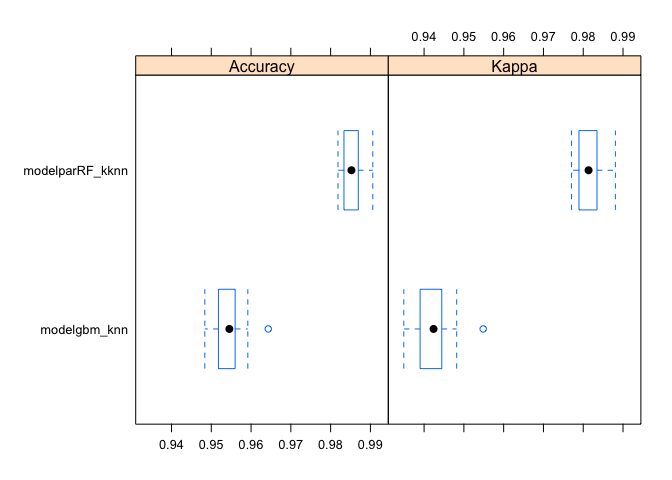

# WriteUp
FAFA  
August of 2015  
## Executive Summary
The goal of these project is to predict the manner in which some people do 
exercise and How Well it was done. The data set contains the "classe" 
feature with a clasification from A to E indicating the kind of exercices
(Sitting, Standing, Walking,...). 
in the next section we're going to clean, pre-processing, train and plot all
steps done to understand the process of prediction.


```
## Warning: package 'kernlab' was built under R version 3.1.3
```

```
## Warning: package 'caret' was built under R version 3.1.3
```

```
## Loading required package: lattice
## Loading required package: foreach
## Loading required package: iterators
## Loading required package: parallel
```

```
## Warning: package 'gbm' was built under R version 3.1.3
```

```
## Loading required package: survival
```

```
## Warning: package 'survival' was built under R version 3.1.3
```

```
## 
## Attaching package: 'survival'
## 
## The following object is masked from 'package:caret':
## 
##     cluster
## 
## Loaded gbm 2.1.1
```

```
## Warning: package 'kknn' was built under R version 3.1.3
```

```
## 
## Attaching package: 'kknn'
## 
## The following object is masked from 'package:caret':
## 
##     contr.dummy
## 
## randomForest 4.6-10
## Type rfNews() to see new features/changes/bug fixes.
```


## Cleaning And Analysis step.
loading files and preparing dataset for machine learning model doing some
cleaning for missing values and also reducing bad predictors.


```r
# i'm loading dataset of training and split in both trainiing and test data set
# after finishing i,m going to change missing values like DIV0 or Blank with 
# NA value., so I'll use later to drop an entery column.

filetra <- "https://d396qusza40orc.cloudfront.net/predmachlearn/pml-training.csv"
download.file(filetra, destfile = "./pml-training.csv", method = "curl")
training <- read.csv("./pml-training.csv", head=TRUE,sep=",", na.strings=c("", "#DIV/0!","NA"))

# split training data set in training and testing data set
training2 <- createDataPartition(y = training$classe, p = 0.7, list = FALSE)
tra <- training[training2, ]
tes <- training[-training2, ]

# I eliminate the columns with NA values but with just only those more than 95% 
# of total of NA's for training and testing datasets, also eliminate 
# the first 7 columns which contains non usefull feature like name, new_windows
# X, and so on.
tra <- subset(tra, select = c(!(colSums(is.na(tra))*100)/(length(tra$X)) > 95))
tes <- subset(tes, select = c(!(colSums(is.na(tes))*100)/(length(tes$X)) > 95))
tra <- tra[,-c(1:7)]
tes <- tes[,-c(1:7)]

# I'm going to review if the new clean dataset contains features with values
# near zero so i can eliminate from the dataset before continuing pre processing 
# the dataset. 

nsv <- nearZeroVar(tra,saveMetrics=TRUE)

# Table 1 for low variability features, so as you see there isn't any feature
# to eliminate for these reason. FALSE value for both zeroVar and nzv feature
print(nsv, type = "html")  
```

```
##                      freqRatio percentUnique zeroVar   nzv
## roll_belt             1.081890    8.04396884   FALSE FALSE
## pitch_belt            1.083333   12.28070175   FALSE FALSE
## yaw_belt              1.058172   12.92858703   FALSE FALSE
## total_accel_belt      1.071202    0.18926986   FALSE FALSE
## gyros_belt_x          1.034197    0.94634928   FALSE FALSE
## gyros_belt_y          1.119754    0.48773386   FALSE FALSE
## gyros_belt_z          1.050643    1.20113562   FALSE FALSE
## accel_belt_x          1.053604    1.16473757   FALSE FALSE
## accel_belt_y          1.105706    0.98274732   FALSE FALSE
## accel_belt_z          1.095624    2.12564607   FALSE FALSE
## magnet_belt_x         1.122047    2.20572177   FALSE FALSE
## magnet_belt_y         1.097192    2.11836646   FALSE FALSE
## magnet_belt_z         1.009146    3.20302832   FALSE FALSE
## roll_arm             54.883721   17.55841887   FALSE FALSE
## pitch_arm            87.444444   20.26643372   FALSE FALSE
## yaw_arm              33.239437   19.12353498   FALSE FALSE
## total_accel_arm       1.033019    0.47317464   FALSE FALSE
## gyros_arm_x           1.008310    4.58615418   FALSE FALSE
## gyros_arm_y           1.475921    2.64249836   FALSE FALSE
## gyros_arm_z           1.124294    1.71070831   FALSE FALSE
## accel_arm_x           1.008264    5.57618112   FALSE FALSE
## accel_arm_y           1.103226    3.79995632   FALSE FALSE
## accel_arm_z           1.080460    5.59074034   FALSE FALSE
## magnet_arm_x          1.030303    9.62364417   FALSE FALSE
## magnet_arm_y          1.111111    6.23134600   FALSE FALSE
## magnet_arm_z          1.000000    9.12135110   FALSE FALSE
## roll_dumbbell         1.054348   86.56184029   FALSE FALSE
## pitch_dumbbell        2.315217   84.40707578   FALSE FALSE
## yaw_dumbbell          1.069767   86.10322487   FALSE FALSE
## total_accel_dumbbell  1.092324    0.29846400   FALSE FALSE
## gyros_dumbbell_x      1.053118    1.71070831   FALSE FALSE
## gyros_dumbbell_y      1.266344    1.93637621   FALSE FALSE
## gyros_dumbbell_z      1.171285    1.41952391   FALSE FALSE
## accel_dumbbell_x      1.004255    2.95552158   FALSE FALSE
## accel_dumbbell_y      1.116279    3.33406129   FALSE FALSE
## accel_dumbbell_z      1.046243    2.91912353   FALSE FALSE
## magnet_dumbbell_x     1.007407    7.80374172   FALSE FALSE
## magnet_dumbbell_y     1.198347    5.96200044   FALSE FALSE
## magnet_dumbbell_z     1.078125    4.83366092   FALSE FALSE
## roll_forearm         12.195556   13.69294606   FALSE FALSE
## pitch_forearm        70.307692   19.07985732   FALSE FALSE
## yaw_forearm          15.941860   12.86307054   FALSE FALSE
## total_accel_forearm   1.155995    0.48773386   FALSE FALSE
## gyros_forearm_x       1.016043    2.06740919   FALSE FALSE
## gyros_forearm_y       1.011152    5.25587828   FALSE FALSE
## gyros_forearm_z       1.049563    2.14748489   FALSE FALSE
## accel_forearm_x       1.112903    5.69265487   FALSE FALSE
## accel_forearm_y       1.082192    7.06850113   FALSE FALSE
## accel_forearm_z       1.055556    4.02562423   FALSE FALSE
## magnet_forearm_x      1.068966   10.66462838   FALSE FALSE
## magnet_forearm_y      1.163636   13.40176167   FALSE FALSE
## magnet_forearm_z      1.175000   11.61825726   FALSE FALSE
## classe                1.469526    0.03639805   FALSE FALSE
```

```r
# In the nest step i'll find the correlated feature to combine them and 
# reduce complexity from training dataset. below you'll see the feature that
# are high correlated each other, and as there is some of them highly correlated
# i'll use the option "pca" when train model to combine them automatically.

M <- abs(cor(tra[,-53]))
diag(M) <-0
xt<-which(M >0.8, arr.ind=T)

# Table 2 for High correlated variables*
print(xt, type = "html")  
```

```
##                  row col
## yaw_belt           3   1
## total_accel_belt   4   1
## accel_belt_y       9   1
## accel_belt_z      10   1
## accel_belt_x       8   2
## magnet_belt_x     11   2
## roll_belt          1   3
## roll_belt          1   4
## accel_belt_y       9   4
## accel_belt_z      10   4
## pitch_belt         2   8
## magnet_belt_x     11   8
## roll_belt          1   9
## total_accel_belt   4   9
## accel_belt_z      10   9
## roll_belt          1  10
## total_accel_belt   4  10
## accel_belt_y       9  10
## pitch_belt         2  11
## accel_belt_x       8  11
## gyros_arm_y       19  18
## gyros_arm_x       18  19
## magnet_arm_x      24  21
## accel_arm_x       21  24
## magnet_arm_z      26  25
## magnet_arm_y      25  26
## accel_dumbbell_x  34  28
## accel_dumbbell_z  36  29
## pitch_dumbbell    28  34
## yaw_dumbbell      29  36
```

## Train models and combining predictions
I'll train differents models using cross validation k-fold approach,
and principal component analysis to reduce highly correlated variables. 
the goal is analyze what's the best method to predict the outcome (classe)
accurately and also combine it.


```r
# I'll use the option to paralelize in several cpu cores when we train the model
# so i can impreove performance, also i'll configure the settings to do 
# cross validation when train model with K-fold approach and 10 folders. Using
# K-fold as a cross validaton improve the accuracy.

registerDoParallel(cores=3)
# cross validation with k-folds settings
set.seed(600)
traincon <- trainControl(method="cv", number=10)

# train several models with training data set using different classifiers
# methods like knn or rf or kknn. below you'll find the function executed.

modelfitknn <- train(classe~.,data=tra,trControl=traincon,preProcess="pca", method="knn")
modelfitgbm <- train(classe~.,data=tra,trControl=traincon,preProcess="pca", method="gbm")
```

```
## Iter   TrainDeviance   ValidDeviance   StepSize   Improve
##      1        1.6094             nan     0.1000    0.1014
##      2        1.5431             nan     0.1000    0.0876
##      3        1.4881             nan     0.1000    0.0713
##      4        1.4433             nan     0.1000    0.0545
##      5        1.4081             nan     0.1000    0.0485
##      6        1.3763             nan     0.1000    0.0442
##      7        1.3473             nan     0.1000    0.0380
##      8        1.3223             nan     0.1000    0.0375
##      9        1.2991             nan     0.1000    0.0307
##     10        1.2785             nan     0.1000    0.0309
##     20        1.1232             nan     0.1000    0.0150
##     40        0.9533             nan     0.1000    0.0064
##     60        0.8465             nan     0.1000    0.0053
##     80        0.7648             nan     0.1000    0.0037
##    100        0.7012             nan     0.1000    0.0017
##    120        0.6463             nan     0.1000    0.0025
##    140        0.5996             nan     0.1000    0.0022
##    150        0.5769             nan     0.1000    0.0016
```

```r
modelfitkknn <- train(classe~.,data=tra,trControl=traincon,preProcess="pca", method="kknn")
modelfitparRF <- train(classe~.,data=tra,trControl=traincon,preProcess="pca", method="parRF")
modelfitrf <- train(classe~.,data=tra,trControl=traincon,preProcess="pca", method="rf")

# As i have chosen several methods and train several models i'll try to use a 
# good combination of the different models, below you'll find the combination of
# the different predictions against testing data set to decide later 
# which one i'll use it

modknn<-predict(modelfitknn,tes)
modgbm<-predict(modelfitgbm,tes)
modkknn<-predict(modelfitkknn,tes)
modparRF<-predict(modelfitparRF,tes)
modrf<-predict(modelfitrf,tes)

# combine models knn&gbm with rf
predf<-data.frame(modknn,modgbm,classe=tes$classe)
combmod<-train(classe~.,method="rf",data=predf)

# combine models kknn$parRF with rf
predf1<-data.frame(modkknn,modparRF,classe=tes$classe)
combmod1<-train(classe~.,method="rf",data=predf1)
```


## Choosing the best model to predict.
I'll analyze the differents models and also plot the accuracy metrics to determine 
why a model is better than other and why, also I'll choose the best one based on
accuracy.


```r
# here i,m resampling the diffrent models to analyze the accuracy and Kappa
# values for all of them together.
resultsnormal <- resamples(list(modelgbm=modelfitgbm, modelkknn=modelfitkknn,
                          modelknn=modelfitknn, modelparRF=modelfitparRF,
                          modelrf=modelfitrf))
resultscomb <- resamples(list(modelgbm_knn=combmod, modelparRF_kknn=combmod1))

# As you'll see below the best model is the model trained with method
# Kknn, other good one are parRF and Random Forest too.
bwplot(resultsnormal)
```

 

```r
# Finally as we haven't find any with value 1 (perfect prediction) we will 
# combine from lower predection to higher prediction together, that's means we'll 
# use gbm and knn method together and also parRF and Kknn as well, both groups 
# trained with random forest (rf). the results is clear the parRF-kknn with random
# forest is the best model to predict
bwplot(resultscomb)
```

 

```r
# Below you'll find the confustionMatrix with Accuracy for the best model chosen
# and confident interval, P-Value, Specificity and Sensitivity
confusionMatrix(tes$classe, predict(combmod1,tes))
```

```
## Confusion Matrix and Statistics
## 
##           Reference
## Prediction    A    B    C    D    E
##          A 1662    9    2    0    1
##          B    6 1122   11    0    0
##          C    2    1 1003   16    4
##          D    1    0   18  941    4
##          E    0    2    3    1 1076
## 
## Overall Statistics
##                                           
##                Accuracy : 0.9862          
##                  95% CI : (0.9829, 0.9891)
##     No Information Rate : 0.2839          
##     P-Value [Acc > NIR] : < 2.2e-16       
##                                           
##                   Kappa : 0.9826          
##  Mcnemar's Test P-Value : NA              
## 
## Statistics by Class:
## 
##                      Class: A Class: B Class: C Class: D Class: E
## Sensitivity            0.9946   0.9894   0.9672   0.9823   0.9917
## Specificity            0.9972   0.9964   0.9953   0.9953   0.9988
## Pos Pred Value         0.9928   0.9851   0.9776   0.9761   0.9945
## Neg Pred Value         0.9979   0.9975   0.9930   0.9965   0.9981
## Prevalence             0.2839   0.1927   0.1762   0.1628   0.1844
## Detection Rate         0.2824   0.1907   0.1704   0.1599   0.1828
## Detection Prevalence   0.2845   0.1935   0.1743   0.1638   0.1839
## Balanced Accuracy      0.9959   0.9929   0.9812   0.9888   0.9952
```

```r
# you'll find the final model below with the samples, predictors and the 5 classes
# also you'll see the final accuracy with the out of error rate.
combmod1$finalModel
```

```
## 
## Call:
##  randomForest(x = x, y = y, mtry = param$mtry) 
##                Type of random forest: classification
##                      Number of trees: 500
## No. of variables tried at each split: 2
## 
##         OOB estimate of  error rate: 1.53%
## Confusion matrix:
##      A    B   C   D    E class.error
## A 1662    9   2   0    1 0.007168459
## B    6 1122  11   0    0 0.014925373
## C    2    7 996  16    5 0.029239766
## D    1    0  18 941    4 0.023858921
## E    1    2   3   2 1074 0.007393715
```

## Cross Validation (Out of sample error).
you'll find below the out of sample error after finishing train model and choose
the best prediction.


```r
# predict on test data set with the best model trained
finalpred <- predict(combmod1, tes)
# True Accuracy of prediction model and percentage
OoSerror <- sum(finalpred == tes$classe)/length(finalpred)
OoSerrorfinal <- 1-OoSerror
p <-OoSerrorfinal*100
paste0("Out of sample error: ", round(p, digits = 2), "%")
```

```
## [1] "Out of sample error: 1.38%"
```


